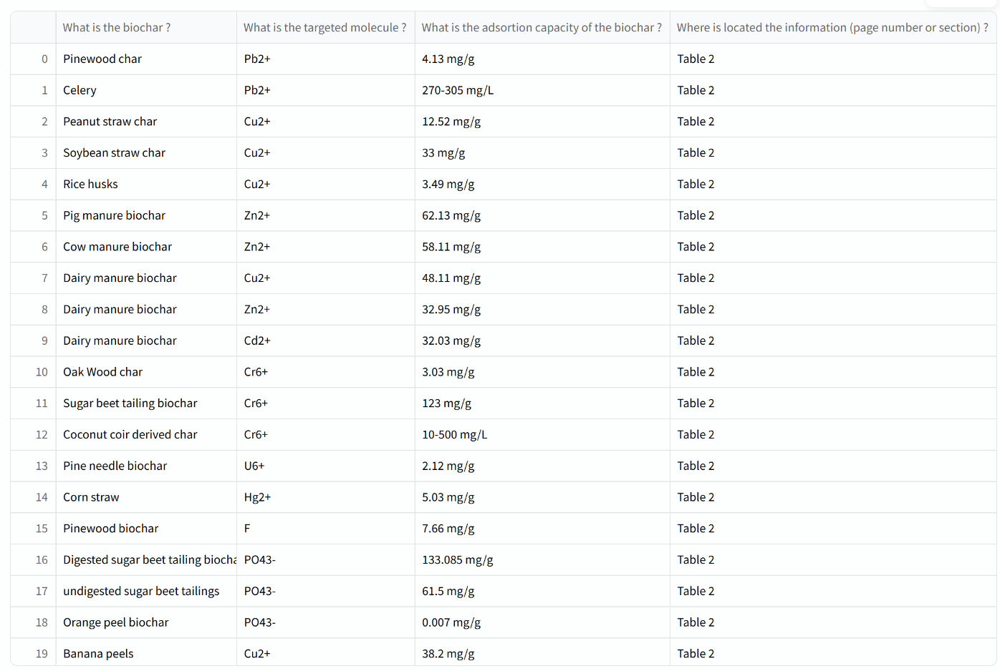

# Technical Interview - LLM Engineer

- Please, don't spend more than 6 hours on this exercice. We are aware that you could spend weeks improving your solution. After 6 hours, stop coding, just write your improvement ideas.
- Use Python and accelerate your developement using LangGraph or similar agentic frameworks.
- We don't expect a Frontend. You can do a fast backend API but it is not mandatory.
- Make this code executable in a Docker container or creating a markdown tutorial.s

## Problem Statement
Your goal is to create an LLM Agent to:
- Process the file provided in the `data` directory
- Answer the following questions on this PDF:
  - What is the biochar ?
  - What is the targeted molecule
  - What is the adsortion capacity of the biochar ?
  - Where is located the information (page number or section) ?

- Output format:
  - The output should be a table (dataframe, markdown or html)
  - Each new row should correspond to a new biochar
  - Each column should be a question

### Example (not exhaustive):

## Prerequisites
- The data is provided in the `data` directory. The file is named `research_paper.pdf`
- You will be given an OpenAI API key with 10$ to conduct your experiments

## Deliverables
We expect you to provide us with:
- Some python scripts that implements the LLM Agent in `src` directory
- Your coding good practises

## Hints
- Use well known agentic framewords to speed up you experiments
- Use cache features in developement to avoid unnecessary API calls (you are limited to $10 of API calls)

